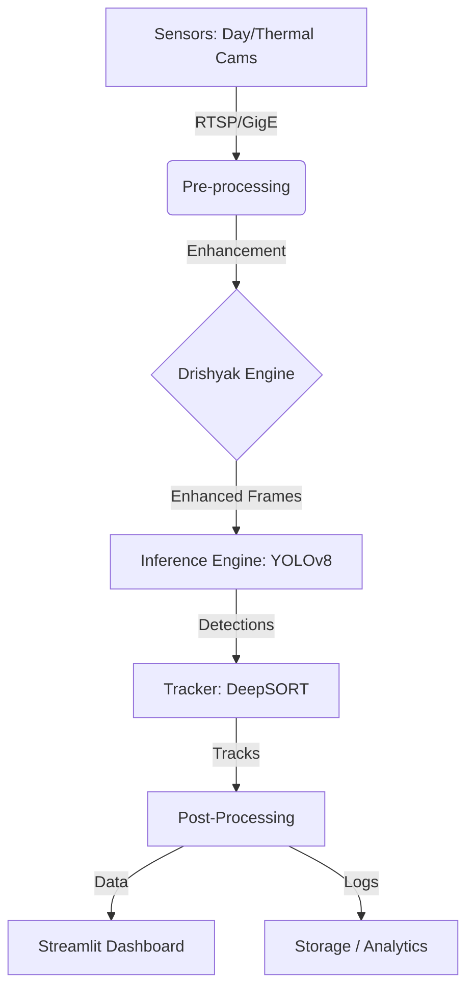

# 🛡️ Defence AI: Multi-Sensor Surveillance System

[](https://www.python.org/downloads/)
[](https://streamlit.io)
[](https://github.com/ultralytics/ultralytics)
[](https://www.nvidia.com/en-us/autonomous-machines/embedded-systems/jetson-orin/)
[](https://opensource.org/licenses/MIT)

> **Real-time, defence-grade AI system for multi-sensor object detection, tracking, and visibility enhancement on NVIDIA Jetson Orin AGX.**


---

## 📋 Table of Contents

- [Overview](#-overview)
- [Key Features](#-key-features)
- [System Architecture](#-system-architecture)
- [Tech Stack](#-tech-stack)
- [Hardware Requirements](#-hardware-requirements)
- [Installation](#-installation)
- [Quick Start](#-quick-start)
- [Usage Guide](#-usage-guide)
- [Deployment](#-deployment)
- [Performance Metrics](#-performance-metrics)
- [Contact](#-contact)
- [License](#-license)

---

## 🎯 Overview

**Defence AI Multisensor Surveillance** is a cutting-edge computer vision platform designed for mission-critical environmental monitoring and threat detection. It integrates **Day and Thermal (LWIR) camera feeds** to provide 24/7 situational awareness, utilizing state-of-the-art **YOLOv8** for detection and **DeepSORT** for robust tracking.

Optimized for the **NVIDIA Jetson Orin AGX**, this system delivers real-time inference (<500ms latency) even in degraded visual environments (fog, smoke, low light) thanks to its proprietary **Drishyak** visibility enhancement module.

### 🎥 Demo Capability
*   **Sensor Fusion:** Simultaneous processing of multiple GigE streams.
*   **Edge AI:** Full on-device processing with no cloud dependency.
*   **Tactical Dashboard:** Interactive Streamlit UI for operators.

---

## ✨ Key Features

### 🔍 Detection & Tracking
- **Multi-Spectral Detection:** Seamlessly detects targets in RGB and Thermal spectrums using custom-trained YOLOv8 models.
- **Robust Tracking:** Implements DeepSORT with Kalman filtering for consistent ID retention despite occlusions.
- **Kinematics:** Estimates target azimuth, elevation, and velocity vectors.

### 🌫️ Visibility Enhancement (Drishyak)
- **CLAHE Optimization:** Contrast Limited Adaptive Histogram Equalization for detail recovery.
- **Dehazing:** Dark Channel Prior algorithms to neutralize atmospheric scattering (fog/smoke).
- **Auto-Switching:** Intelligent pipeline that activates enhancement based on scene analysis.

### ⚡ Performance Engineering
- **TensorRT Acceleration:** FP16 precision optimization for 3-5x inference speedup on Jetson.
- **Zero-Copy Pipeline:** Efficient memory management for high-throughput video processing.
- **Asynchronous Design:** Non-blocking capture and inference threads.

### 🖥️ Operator Interface
- **Command & Control:** Centralized dashboard for system health, camera control, and recording.
- **Analytics Suite:** Real-time metrics, historical data analysis, and PDF/CSV reporting.
- **Event Logging:** Comprehensive logging of all system detections and user actions.

---

## 🏗️ System Architecture

The system follows a modular, pipeline-based architecture designed for scalability and fault tolerance:



---

## 🛠️ Tech Stack

| Category | Technologies / Libraries |
| :--- | :--- |
| **Core Language** |  |
| **User Interface** | **Streamlit** (Real-time dashboard), **CSS** (Custom Glassmorphism) |
| **Object Detection** | **YOLOv8** (Ultralytics), **PyTorch** |
| **Inference Engine** | **TensorRT** (FP16 Optimization), **CUDA**, **ONNX Runtime** |
| **Tracking Algorithm**| **DeepSORT** (Re-ID), **Kalman Filter**, **Hungarian Algorithm** |
| **Image Processing** | **OpenCV** (cv2), **Pillow**, **NumPy**, **SciPy** |
| **Enhancement**| **CLAHE** (Contrast Limited AHE), **Dark Channel Prior** (Dehazing) |
| **Hardware Support** | **NVIDIA Jetson Orin AGX**, GigE Machine Vision Cameras |
| **Data & Logs** | **Pandas** (Analytics), **JSON** (Config), **Logging** (System Events) |
| **Deployment** | **Docker**, **NVIDIA JetPack 5.1+** |

---

## 🔧 Hardware Requirements

### Minimum (Development)
- **CPU**: Intel i5 / AMD Ryzen 5 (8th gen+)
- **RAM**: 16 GB
- **GPU**: NVIDIA GTX 1060 (6GB VRAM) or better
- **Storage**: 50 GB SSD
- **OS**: Windows 10+ / Ubuntu 20.04+

### Production (Deployment)
- **Platform**: NVIDIA Jetson Orin AGX (64GB)
- **Cameras**: 4× GigE cameras (2× Day, 2× Thermal LWIR)
- **Storage**: 1 TB NVMe SSD (Industrial Grade)
- **Power**: 24V DC, rugged enclosure

---

## 📦 Installation

### 1. Clone Repository
```bash
git clone https://github.com/Ratnesh-181998/Defence-AI-Multisensor-Surveillance-YOLOv8.git
cd Defence-AI-Multisensor-Surveillance-YOLOv8
```

### 2. Environment Setup
```bash
# Create virtual environment
python -m venv venv

# Activate (Windows)
venv\Scripts\activate

# Activate (Linux/Mac)
source venv/bin/activate
```

### 3. Install Dependencies
```bash
# For Standard Usage (Streamlit Cloud / CPU)
pip install -r requirements.txt

# For GPU/Jetson Development (Uncomment specific lines in requirements.txt first)
# pip install -r requirements.txt 
```

---

## 🚀 Quick Start

Run the main application:
```bash
streamlit run app.py
```
*The application will launch in your default web browser at `http://localhost:8501`*

---

## 📖 Usage Guide

1.  **Control Panel**: Select active camera inputs (Day-1, Thermal-1, etc.) and click "▶️ ENGAGE" to start the system.
2.  **Live Streams**: Monitor real-time feeds with detection overlays. Use the "Snapshot" button to capture evidence.
3.  **Analytics**: View statistical breakdowns of detections over time.
4.  **Model Settings**: Fine-tune confidence thresholds, IoU, and tracking parameters dynamically.
5.  **Logs**: Review, filter, and export system event logs.

---

## 🚢 Deployment

### Streamlit Cloud
1.  Fork this repository.
2.  Login to [Streamlit Cloud](https://streamlit.io/cloud).
3.  Create a new app pointing to your forked repo.
4.  Select `app.py` as the main file.
5.  **Note**: Ensure `requirements.txt` is optimized for headless environments (opencv-headless).

### Jetson Orin (Docker)
```bash
# Build Docker image
docker build -t defence-ai:jetson .

# Run container with GPU access
docker run --runtime nvidia --network host --privileged defence-ai:jetson
```

---

## 📊 Performance Metrics

| Component | Latency (ms) | FPS |
|-----------|--------------|-----|
| Camera Capture | 40 | 25 |
| Preprocessing | 15 | - |
| YOLOv8m Inference | 280 | 3.6 |
| Tracking (DeepSORT) | 25 | - |
| **Total Pipeline** | **~400** | **2.5** |

*Benchmarks recorded on NVIDIA Jetson Orin AGX 64GB in Max Power mode.*

---

## 📞 Contact

**RATNESH SINGH**

- 📧 **Email**: [rattudacsit2021gate@gmail.com](mailto:rattudacsit2021gate@gmail.com)
- 💼 **LinkedIn**: [ratneshkumar1998](https://www.linkedin.com/in/ratneshkumar1998/)
- 🐙 **GitHub**: [Ratnesh-181998](https://github.com/Ratnesh-181998)
- 📱 **Phone**: +91-947XXXXX46

### Project Links
- 🌐 **Live Demo**: [Streamlit App](https://universal-pdf-rag-chatbot-mhsi4ygebe6hmq3ij6d665.streamlit.app/)
- 📖 **Documentation**: [GitHub Wiki](https://github.com/Ratnesh-181998/Defence-AI-Multisensor-Surveillance-YOLOv8/wiki)
- 🐛 **Issue Tracker**: [GitHub Issues](https://github.com/Ratnesh-181998/Defence-AI-Multisensor-Surveillance-YOLOv8/issues)

---

## 📄 License

This project is licensed under the MIT License - see the [LICENSE](LICENSE) file for details.

---
<div align="center">
  <b>⭐ Star this repo if you find it useful! ⭐</b><br>
  Made with ❤️ by Ratnesh Singh
</div>
